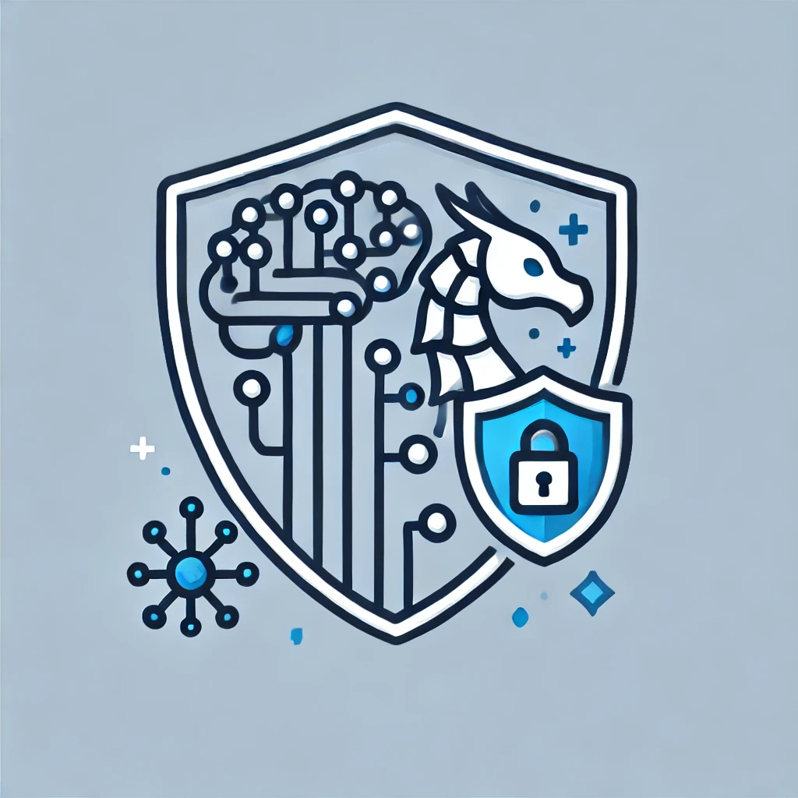

<!-- Logo needs to be touched up; add our name-->

<!--The badges will not work until our repo is public-->
<!-- We should add badges for Huggingface, PyPI, and Conda -->
 

As machine learning approaches to artificial intelligence continue to grow in popularity, the need for secure implementation and evaluation becomes increasingly paramount. This is of especially great concern in safety-critical applications such as object detection for self driving cars, monitoring nuclear power plants, and giving medical diagnoses. To this end we present a simple yet comprehensive interface for robust training and evaluation of PyTorch classifiers.

Although other solutions such as the [adversarial robustness toolbox](https://github.com/Trusted-AI/adversarial-robustness-toolbox) and [MAIR](https://github.com/Harry24k/MAIR) have provided solutions for this in the past, they are not as comprehensive in breadth of provided attacks and defenses.

### Included Defenses
- Adversarial Distributional Training (ADT)
- Adversarial Distributional Training++ (ADTPP)
- Adversarial Weight Distribution ([ATAWP](https://arxiv.org/abs/2004.05884))
- Currat
- Federated Adversarial Training ([FAT](https://arxiv.org/pdf/2012.01791))
- Feature Scatter ([FS](https://arxiv.org/abs/1907.10764))
- Geometry Aware Instance Reweighted Adversarial Training ([GAIRAT](https://github.com/zjfheart/Geometry-aware-Instance-reweighted-Adversarial-Training))
- TRadeoff-inspired Adversarial DEfenses via Surrogate loss minimization ([TRADES](https://github.com/yaodongyu/TRADES))
- TRADES with Adversarial Weight Distribution (TRADESAWP)
- Various Attacks (VA)
- You Only Propogate Once ([YOPO](https://arxiv.org/abs/1905.00877))

## Installation
<!-- We will want a PyPI or conda package in the future; this is a very temporary solution -->
Our work is available via this repository. In order to install from here, you will need:
- The [Conda](https://www.anaconda.com/) environment manager.
- The [Git](https://www.git-scm.com/) version control system.

### Cloning the Repository
First our repository will need to be cloned:
```bash
git clone https://github.com/LAiSR-SK/AiRobustnessTestingKit-AiR-TK-
```

<!-- Do we want to provide a Linux environment?-->
Then create and activate the conda environment:
```bash
conda env create -p .conda

conda activate ./.conda
```

### Pretrained Models
<!-- We need to add our huggingface models -->
In order to expedite progress in the field of secure AI, we have provided the weights of our trained models on [huggingface]().

## Examples
### Defenses
You can import and use our defenses as shown:
```python
from torch import nn

from airtk.defense import TradesTraining

if __name__ == "__main__":
    # Initialize the training function
    training = TradesTraining(batch_size=512,
                              "cifar10",
                              "res101",
                              epochs=100,
                              lr=0.01,
                              seed=0,
                              model_dir="data/model/TRADES/",
                              save_freq=10)
                              
    # Run the specified training regime
    training()
```

## Cite Us
See [CITATION.cff](CITATION.cff) for details on how to cite our work.
