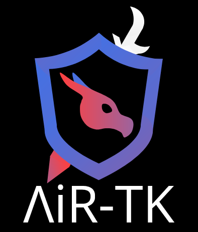

<!-- Logo needs to be touched up; add our name-->
<span align="center">



[](https://pypi.org/project/airtk/)
[](https://pypi.org/project/airtk/)


</span>

As machine learning approaches to artificial intelligence continue to grow in popularity, the need for secure implementation and evaluation becomes increasingly paramount. This is of especially great concern in safety-critical applications such as object detection for self driving cars, monitoring nuclear power plants, and giving medical diagnoses.

**AI Robustness Testing Kit (AiR-TK)** is an AI testing framework built upon PyTorch that enables the AI security community to evaluate the AI models against adversarial attacks easily and comprehensively. Furthermore, Air-TK supports adversarial training, the de-facto technique to improve the robustness of AI models against adversarial attacks. Having easy access to state-of-the-art adversarial attacks and the baseline adversarial training method in one place will help the AI security community to replicate, re-use, and improve the upcoming attacks and defense methods.   

Although other solutions such as the [adversarial robustness toolbox](https://github.com/Trusted-AI/adversarial-robustness-toolbox) and [MAIR](https://github.com/Harry24k/MAIR) have provided solutions for this in the past, they are not as comprehensive in breadth of provided attacks and defenses.

# Installation
Our work is available via this repository and as a [PyPI package](https://pypi.org/project/airtk/).

## From PyPI (Recommended)
```bash
python3 -m pip install airtk
```

## From Repo Source (Not Recommended)
In order to install from here, you will need:
- The [Conda](https://www.anaconda.com/) environment manager.
- The [Git](https://www.git-scm.com/) version control system.

```bash
git clone https://github.com/LAiSR-SK/AiRobustnessTestingKit-AiR-TK-
```

```bash
conda env create -p .conda

conda activate ./.conda
```

# Contents
## Attacks
<!-- TODO: Aibak -->

## Defenses
You can import and use our defenses as shown:
```python
from torch import nn

from airtk.defense import TradesTraining

if __name__ == "__main__":
    # Initialize the training function
    training = TradesTraining(batch_size=512,
                              "cifar10",
                              "res101",
                              epochs=100,
                              lr=0.01,
                              seed=0,
                              model_dir="data/model/TRADES/",
                              save_freq=10)
                              
    # Run the specified training regime
    training()
```

We support the following defenses:
- Adversarial Distributional Training (ADT)
- Adversarial Distributional Training++ (ADTPP)
- Adversarial Weight Distribution ([ATAWP](https://arxiv.org/abs/2004.05884))
- Curriculum Adversarial Training (Currat)
- Federated Adversarial Training ([FAT](https://arxiv.org/pdf/2012.01791))
- Feature Scatter ([FS](https://arxiv.org/abs/1907.10764))
- Geometry Aware Instance Reweighted Adversarial Training ([GAIRAT](https://github.com/zjfheart/Geometry-aware-Instance-reweighted-Adversarial-Training))
- TRadeoff-inspired Adversarial DEfenses via Surrogate loss minimization ([TRADES](https://github.com/yaodongyu/TRADES))
- TRADES with Adversarial Weight Distribution (TRADESAWP)
- Various Attacks (VA)
- You Only Propogate Once ([YOPO](https://arxiv.org/abs/1905.00877))

Most of which can use the following keyword arguments:
| kwarg name    | use                                   |
|---------------|---------------------------------------|
| dataset_name  | name of the dataset to use            |
| model_name    | name of the model to use              |
| epochs        | number of epochs to train / test for  |
| batch_size    | size of training and testing batches  |
| eps           | size of image perturbations           |
| model_dir     | directory to save models to           |

## Pretrained Models
In order to expedite progress in the field of secure AI, we have provided the weights of our trained models on [huggingface](https://huggingface.co/LAiSR-SK). These can be loaded via `load_pretrained` and then or further augmented:

```python
import torch
from airtk.data import CIFAR100
from airtk.model import ResNet50
from torch.utils.data import DataLoader

if __name__ == "__main__":
    torch.set_default_device("cuda")

    # 1. Load the model
    model: ResNet50 = ResNet50.from_pretrained("LAiSR-SK/curriculum-at-cifar100-res50")
    
    # 2. Evaluate the model against CIFAR100
    testset: CIFAR100 = CIFAR100(root="data/", train=False, download=True)
    test_loader: DataLoader = DataLoader(testset, batch_szie = 256, shuffle=True)
    
    total: int = 0
    correct: int = 0
    for x, y in test_loader:
        logits = model(x)
        _, predicted = torch.max(logits, 1)

        total_correct += (predicted == y).sum().item()
        total += predicted.size[0]
        
    acc: float = 100 * correct / total

    print(f"Accuracy: {acc}")
```

## Cite Us
See [CITATION.cff](CITATION.cff) or the sidebar for details on how to cite our work.
